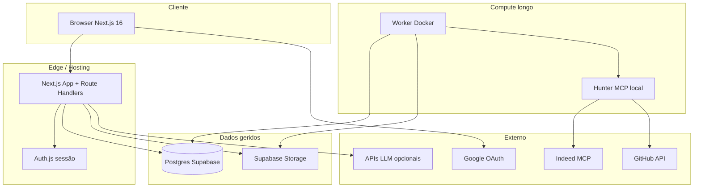
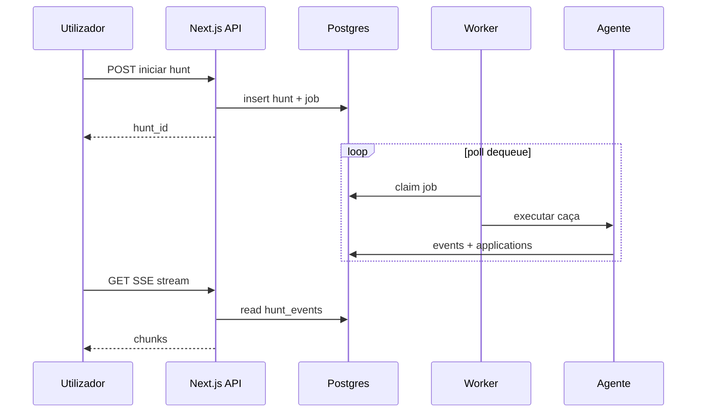

# Arquitetura geral — Hunter Platform

Este documento descreve **componentes**, **fluxos** e **fronteiras de confiança**. Complementa [plataforma-visao.md](plataforma-visao.md).

---

## 1. Visão em camadas

---

## 2. Responsabilidades por componente

| Componente               | Responsabilidade                                                                                     | Não faz                                                         |
| ------------------------ | ---------------------------------------------------------------------------------------------------- | --------------------------------------------------------------- |
| **Next.js (App Router)** | UI, Server Actions / Route Handlers, validação Zod, **filtrar por `user_id` da sessão**, SSE de live | Não corre hunts longos no request HTTP síncrono                 |
| **Auth.js**              | Sessão, Google OAuth, `user.id` estável                                                              | Não substitui autorização na BD (isso é código servidor)        |
| **Postgres**             | Fonte de verdade: hunts, jobs, applications, events                                                  | Não exposto directamente ao browser                             |
| **Supabase Storage**     | CVs e exports opcionais                                                                              | Não público; sem URLs permanentes no cliente                    |
| **Worker**               | Dequeue `jobs`, executar agente, escrever resultados e eventos                                       | Não serve HTTP ao utilizador final                              |
| **Hunter MCP**           | Pesquisar vagas, normalizar, deduplicar e pontuar openings                                           | Não decide política de negócio (limites de quota são do worker) |

---

## 3. Fluxos principais

### 3.1 Login

1. Utilizador → Google OAuth.
2. Auth.js cria sessão (cookie).
3. `profiles` upsert na primeira visita (Route Handler ou callback).

### 3.2 Upload de CV e estratégia

1. Next recebe multipart → valida tamanho/MIME → upload Storage path `{user_id}/{cv_id}.pdf`.
2. Extracção de texto (opcional) → grava em `cvs` / ou só processa em memória.
3. IA gera `criteria_json` + `prompt_text` → utilizador edita → grava `strategies`.

### 3.3 Iniciar hunt

1. UI chama API `POST /api/hunts` (ou Server Action).
2. API cria `hunts` + `strategy_snapshot_json` + enfileira `jobs` (`type = run_hunt`).
3. Resposta imediata com `hunt_id` (202/200).

### 3.4 Worker processa hunt

1. Worker faz `SELECT … FOR UPDATE SKIP LOCKED` em `jobs`.
2. Carrega estratégia snapshot do `hunts`.
3. Invoca subprocesso/SDK do agente com prompts montados.
4. Persiste `openings`, `applications`, `hunt_events`; actualiza `hunts.status`.
5. Marca `job` como `done` ou `dead` após retries.

### 3.5 Live no painel

1. Cliente abre EventSource para `GET /api/hunts/:id/stream` (SSE).
2. Handler autentica sessão, verifica `hunt.user_id`, faz poll em `hunt_events` ou long-poll com cursor — **ou** lê incrementalmente desde último `id`.

_(Realtime nativo do Supabase no browser fica de fora enquanto não houver JWT Supabase no cliente.)_

---

## 4. Deploy sugerido (orçamento baixo)

| Peça               | Opção A                                  | Opção B                  |
| ------------------ | ---------------------------------------- | ------------------------ |
| Front              | Vercel Hobby                             | Docker + Caddy numa VPS  |
| Worker             | Mesma VPS que Redis-less                 | Máquina dedicada pequena |
| Postgres + Storage | Supabase Free                            | —                        |
| Segredos           | Env no Vercel / `docker compose` secrets |                          |

**Variáveis críticas:** `DATABASE_URL`, `SUPABASE_SERVICE_ROLE_KEY` (só servidor), `NEXTAUTH_SECRET`, `GOOGLE_*`, chaves do agente/LLM.

---

## 5. Limites e confiança

- **BFF:** o browser **nunca** recebe `service_role` key.
- **Worker:** usa `DATABASE_URL` com permissões de escrita; pode estar na mesma VPC/rede privada que a BD se migrares para self-hosted Postgres.
- **Idempotência:** `jobs.idempotency_key` para o mesmo “clique” não duplicar hunts.

---

## 6. Diagrama de sequência (hunt simplificado)

---

## 7. Evolução futura

- **Fila Redis:** se `SKIP LOCKED` deixar de chegar por volume.
- **Multi-região:** não prioritário para MVP.
- **Separar API read-only** para relatórios pesados (replica).

Ver também [workers.md](workers.md) e [integracoes-externas.md](integracoes-externas.md).
