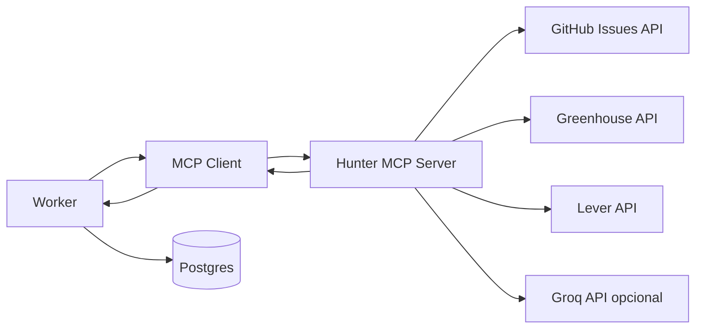

# Hunter MCP — documentação e plano de ação

Este documento define o MCP próprio do Hunter para descoberta e ranking de vagas, sem dependência obrigatória de Claude.

## 1. Objetivo

- Centralizar conectores de fontes de vagas em um servidor MCP local.
- Expor ferramentas canônicas para o worker montar a pipeline de hunt.
- Permitir evolução incremental (mais fontes e mais inteligência) sem reescrever o worker.

## 2. Escopo da primeira versão

Implementado em `apps/web/scripts/mcp`:

- Servidor MCP local via stdio (JSON-RPC com framing Content-Length).
- Ferramentas principais:
  - `search_openings`
  - `get_opening_detail`
  - `normalize_opening`
  - `dedupe_openings`
  - `score_opening_with_groq`
  - `rank_openings`
- Conectores iniciais:
  - GitHub Issues (`backend-br/vagas`, `frontendbr/vagas` por default)
  - Greenhouse Job Board API
  - Lever Postings API
- Integração no worker (`HUNT_EXECUTOR=mcp`) como execução padrão.

## 3. Arquitetura

## 4. Contrato de dados canônico

Cada vaga normalizada segue o shape abaixo:

- `source`, `sourceId`
- `title`, `companyName`, `description`
- `locationText`, `countryCode`, `remoteType`
- `employmentType`, `seniority`, `skills`
- `salaryMin`, `salaryMax`, `salaryCurrency`
- `postedAt`, `validThrough`
- `applyUrl`, `sourceUrl`
- `language`, `metadata`
- `dedupeFingerprint`
- `matchScore` (depois de score)

## 5. Ferramentas MCP

### 5.1 `search_openings`

Entrada:

- `filters` com palavras-chave, senioridade, regime, países e exclusões.

Saída:

- `openings[]` no formato canônico.
- `meta.total` e `meta.errors` por provedor.

### 5.2 `normalize_opening`

Entrada:

- `opening` bruto/canônico.

Saída:

- `opening` com defaults, sanitização e `dedupeFingerprint`.

### 5.3 `dedupe_openings`

Entrada:

- `openings[]`.

Saída:

- `openings[]` deduplicadas.
- `removed` com total removido.

### 5.4 `score_opening_with_groq`

Entrada:

- `opening`
- `profile` (estratégia)

Saída:

- `opening` com `matchScore`.

Regra:

- Se `GROQ_API_KEY` existir: chama Groq.
- Se não existir: fallback heurístico por sobreposição de keywords.

### 5.5 `rank_openings`

Entrada:

- `openings[]` com score.

Saída:

- `openings[]` ordenadas por score e recência.

## 6. Fluxo de execução no worker

1. Worker gera/recupera estratégia da hunt.
2. Worker inicia cliente MCP local.
3. Pipeline:
   - `search_openings`
   - `dedupe_openings`
   - `score_opening_with_groq` para cada vaga
   - `rank_openings`
4. Worker persiste `openings`/`applications`.
5. Worker emite `hunt_events` e finaliza status.

## 7. Variáveis de ambiente

- `HUNT_EXECUTOR=mcp`
- `GITHUB_TOKEN` (opcional, recomendado para rate limit)
- `GREENHOUSE_BOARD_TOKENS` (csv, ex: `empresa1,empresa2`)
- `LEVER_SITES` (csv, ex: `acme,foo`)
- `GROQ_API_KEY` (opcional)
- `GROQ_MODEL` (opcional, default `llama-3.1-8b-instant`)

## 8. Execução

Na raiz:

- `yarn mcp:server` para subir o servidor MCP isolado.
- `yarn worker` para rodar worker com executor MCP (default).

## 9. Plano de ação (próximas fases)

### Fase 1 (feito)

- Servidor MCP local funcional.
- Ferramentas centrais de busca, dedupe, score e rank.
- Integração no worker.

### Fase 2

- Adicionar conector Workable e um conector agregador opcional.
- Adicionar paginação multi-página por fonte.
- Melhorar classificação de remoto/híbrido e localização BR (cidade/UF).

### Fase 3

- Camada de compliance por fonte (ToS/rate limit) com bloqueio explícito.
- Cache incremental por `sourceId + updatedAt`.
- Métricas de qualidade: taxa de duplicidade, taxa de vaga expirada.

### Fase 4

- Expor telemetria para relatórios por período.
- Integrar timeline live por eventos granulares de cada etapa MCP.

## 10. Observações de segurança

- Não armazenar segredos em código.
- Não persistir PII desnecessária nas vagas.
- Tratar erro por provedor sem derrubar a hunt inteira.
