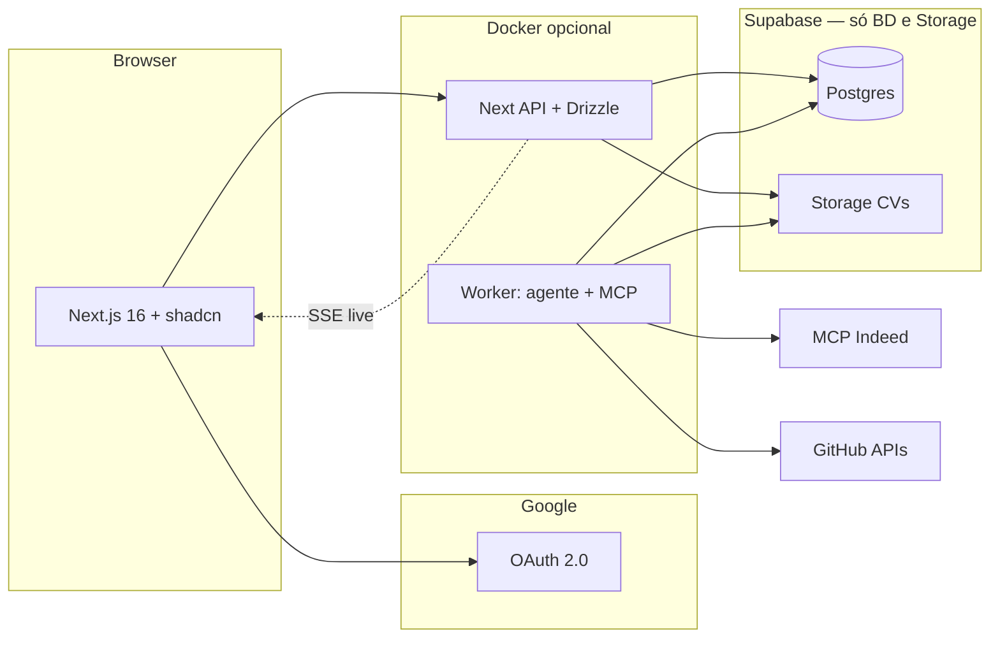

# Hunter Platform — Visão, arquitetura e roadmap

Documento de referência para evoluir o **hunter** (worker + MCP + painel web) numa **plataforma containerizada** com painel web (**Next.js 16**, **shadcn/ui**), **Drizzle ORM** sobre **Postgres + Storage via Supabase** (sem usar o auth do Supabase), **Auth.js (NextAuth) com Google OAuth**, **assistência de IA para CV e estratégia de caça**, **visibilidade clara das candidaturas** (com link original da vaga), observabilidade em tempo quase real e gestão do ciclo de vida das “caçadas” — com **foco em orçamento pequeno** e **facilidade de migração** para outro Postgres / outro object storage.

**Documentação auxiliar (detalhe técnico):** [Índice `docs/README.md`](README.md) — [Estrutura do banco](estrutura-banco.md) · [Arquitetura geral](arquitetura.md) · [Design system / UI kit](design-system.md) · [Workers](workers.md) · [Integrações e APIs externas](integracoes-externas.md).

---

## 1. O que existe hoje (baseline)

| Peça                          | Função                                               |
| ----------------------------- | ---------------------------------------------------- |
| `apps/web/src`                | Aplicação web (dashboard, auth e APIs)               |
| `apps/web/scripts/worker.mjs` | Worker de fila (jobs/hunts)                          |
| `apps/web/scripts/mcp`        | Servidor MCP local e conectores                      |
| `packages/db`                 | Schema e comandos Drizzle                            |
| `docker-compose.yml`          | Orquestração local (postgres + worker, web opcional) |

**Limitações actuais:** SSE/live e relatórios por período ainda estão em evolução; faltam etapas de hardening operacional para produção.

---

## 2. Visão do produto

**Objetivo:** um serviço que orquestra “jobs de caça” (hunts), persiste resultados e eventos no **Postgres** (hospedado no Supabase), ficheiros de CV no **Storage do Supabase**, e expõe um **painel Next.js 16** com **login via Google OAuth (Auth.js / NextAuth)** para:

- **Configurar a estratégia** com apoio de IA a partir do **CV** (upload ou texto), produzindo critérios estruturados equivalentes ao `user-prompt` — editáveis antes de guardar.
- Ver **atividade em tempo quase real** (logs / progresso) — ver secção 4 quanto a **SSE via Next** vs Realtime.
- Gerar **relatórios por período**.
- **Iniciar / pausar / retomar** o processamento.
- Ver **claramente em que vagas estás a candidatar-te** (ou em fila), com **URL original da vaga**, plataforma, data e estado.

Tudo empacotável em **Docker** (worker + opcionalmente front self-hosted). **Não acoplamos identidade ao Supabase Auth** — só à **BD e ao bucket**, o que simplifica uma futura migração (ex.: Neon, RDS, Cloud SQL + MinIO/S3).

**Princípios sugeridos:**

- **Separar** “interface + API” de “executor do agente” (worker) para escalar e isolar falhas.
- **Event-sourcing leve:** cada passo relevante vira evento persistido para alimentar o painel e relatórios.
- **Idempotência** nos exports e nas candidaturas (evitar duplicar a mesma vaga / mesma URL no mesmo utilizador).
- **Dados pessoais (CV):** bucket **privado**, caminhos por `user_id`; acesso apenas vindo do **servidor** (sessão NextAuth validada); encriptação em trânsito; política clara de retenção.

---

## 3. Funcionalidades — a tua ideia + sugestões

### 3.1 Já mencionadas por ti

| Funcionalidade                       | Notas de implementação                                                                                                                                                                                                                                                     |
| ------------------------------------ | -------------------------------------------------------------------------------------------------------------------------------------------------------------------------------------------------------------------------------------------------------------------------- |
| **Docker**                           | `Dockerfile` multi-stage para Next.js; imagem separada para o worker; `docker-compose` com rede interna, volumes para artefactos opcionais, secrets via env / Docker secrets.                                                                                              |
| **Painel Next.js 16**                | App Router; rotas para Dashboard, Hunts, Configuração, Relatórios, Candidaturas, CV/Estratégia, Admin do serviço.                                                                                                                                                          |
| **Movimentação em tempo quase real** | **Recomendado (com NextAuth):** **SSE ou polling** exposto por **Route Handlers** no Next, com dados filtrados pela sessão — sem depender de `auth.uid()` do Supabase. **Supabase Realtime** fica **opcional** (exige JWT compatível ou canais só servidor, mais fricção). |
| **Relatório por período**            | Filtros: data início/fim, plataforma, score mínimo; agregados via SQL (Postgres) na API.                                                                                                                                                                                   |
| **Play / pause do serviço**          | Definir: (a) pausar _scheduler_, (b) pausar hunt em curso, (c) pausar worker. API: `POST /service/state`.                                                                                                                                                                  |

### 3.2 Sugestões adicionais (alto valor)

- **Autenticação:** **Auth.js (NextAuth v5)** com **Google OAuth** — um único fornecedor no MVP; sessão no Next; `user.id` estável (preferir o ID interno do NextAuth / adapter, e opcionalmente guardar `google_sub` em `profiles`).
- **Agendamento (cron):** cron na **VPS do worker** (custo 0 extra) ou serviço externo barato; evitar depender de Edge Functions do Supabase se quiseres menos lock-in.
- **Templates de estratégia:** vários perfis guardados (`strategies`) ligados ao utilizador.
- **Diff entre caçadas:** comparar IDs/plataforma entre execuções.
- **Alertas:** webhook gratuito (Discord/n8n self-host).
- **Gestão de segredos:** `GOOGLE_CLIENT_ID/SECRET`, `NEXTAUTH_SECRET`, `DATABASE_URL`, `SUPABASE_SERVICE_ROLE_KEY` só no servidor; nunca no cliente.
- **Retenção:** job que apaga CV antigo ou anonimiza após X dias.
- **Fila de trabalhos:** tabela `jobs` no Postgres com `FOR UPDATE SKIP LOCKED` — **sem Redis** no orçamento mínimo.
- **Healthchecks:** `/health` no worker e na API.
- **Modo “dry-run”:** só listar vagas sem marcar candidatura.

### 3.3 Assistência de IA: CV → estratégia (equivalente ao `user-prompt`)

**Fluxo desejado:**

1. Utilizador faz **upload de PDF/DOCX** ou cola texto → guardar no **Supabase Storage** (bucket privado, path ex.: `{user_id}/{cv_id}.pdf`) e/ou extrair texto no servidor.
2. Passo opcional **sem modelo pago:** extração de texto com `pdf-parse`, Mammoth, etc. (custo 0).
3. Chamada a um **modelo leve / barato** para gerar um **JSON de estratégia** validado + resumo em linguagem natural para o worker.
4. Utilador **revê e edita** no formulário antes de guardar (`strategies` versão final).

**Regras de produto:** a IA **sugere**; a decisão final é sempre humana.

_Detalhes de custo na secção 10._

### 3.4 Candidaturas: link original e estados claros

**Objetivo:** painel onde cada linha é uma **candidatura** (ou intenção) com:

| Campo (exemplo)   | Descrição                                                                              |
| ----------------- | -------------------------------------------------------------------------------------- |
| `opening_title`   | Título da vaga                                                                         |
| **`opening_url`** | **Link canónico / original** (Indeed, Gupy, issue GitHub, etc.)                        |
| `platform`        | Indeed, backend-br, …                                                                  |
| `status`          | `suggested` → `shortlisted` → `queued` → `applying` → `applied` / `failed` / `skipped` |
| `match_score`     | 0–100 (da última hunt)                                                                 |
| `hunt_id`         | Ligação à execução que originou                                                        |
| `notes`           | Erro, motivo de skip, etc.                                                             |
| `applied_at`      | Quando concluído                                                                       |

**Importante:** o **URL original** nunca deve ser perdido na normalização; se houver redirect, guardar também `source_url` e `canonical_url` se descobrires ambos.

**UI:** tabela filtrável, cores por estado, link que abre em nova aba sempre visível (ícone externo).

### 3.5 Painel — páginas sugeridas

1. **Dashboard** — última execução, estado do serviço, contagem do dia.
2. **Hunts** — lista de execuções, duração, export CSV.
3. **Live** — stream de eventos (SSE ligado à sessão).
4. **Relatórios** — período, agregados, export.
5. **CV & Estratégia** — upload, assistente IA, edição, versões.
6. **Candidaturas** — pipeline completo com **link original** em destaque.
7. **Sistema** — play/pause, versão, credenciais (mascaradas).

---

## 4. Arquitetura alvo (alto nível)

**Decisão de auth:** **não** usar Supabase Auth. **Auth.js** valida Google OAuth e mantém a sessão; o **subject** na aplicação é o `user.id` da sessão (e colunas `user_id` nas tabelas).

**Fluxo resumido:**

1. Login Google → sessão NextAuth → API conhece o utilizador.
2. Leituras/escritas à BD e ao Storage: **sempre** através de código servidor com **`user_id` da sessão** (ou worker com `service_role` e `user_id` explícito no job).
3. **Live feed:** Next abre **SSE** (ou polling) que consulta Postgres com o mesmo critério — evita browser com `anon key` e RLS baseada em `auth.uid()`.

**Porque facilita migração:** o código depende de **Postgres** (`DATABASE_URL`) e de **S3-compatible storage** (o Supabase Storage expõe API compatível; amanhã podes apontar para **MinIO**, **R3**, **S3**) sem reescrever auth.

---

## 5. Stack sugerida (mínimo viável → produção)

| Camada             | Sugestão                                                                                                                                    |
| ------------------ | ------------------------------------------------------------------------------------------------------------------------------------------- |
| UI                 | Next.js 16, React 19.x, **shadcn/ui** (Radix + Tailwind), tipografia e tokens consistentes                                                  |
| Auth               | **Auth.js (NextAuth) + Google OAuth**                                                                                                       |
| ORM / dados        | **Drizzle ORM** + `postgres`/`pg` driver — schema em TypeScript, queries tipadas, **drizzle-kit** para migrações geradas a partir do código |
| API                | Next Route Handlers / Server Actions; **sem** expor cliente Drizzle no browser — só camada servidor                                         |
| Dados estruturados | **Postgres** (Supabase como host)                                                                                                           |
| Ficheiros (CV)     | **Supabase Storage** via SDK **só no servidor** (upload assinado ou proxy)                                                                  |
| Validação          | **Zod** (/forms + input de IA) alinhado aos tipos do Drizzle onde fizer sentido                                                             |
| Fila               | Postgres (`jobs` + `SKIP LOCKED`), sem Redis no MVP                                                                                         |
| Worker             | Docker: Node com dependências do monorepo; **mesmo `DATABASE_URL`** e Drizzle opcional no worker para escritas tipadas                      |
| Reverse proxy      | Caddy com TLS em VPS barata, ou Vercel Hobby para o Next                                                                                    |
| Observabilidade    | Logs JSON no stdout do worker; Sentry opcional (free tier limitado)                                                                         |

### 5.1 Drizzle — notas de uso

- **Migrações:** `drizzle-kit generate` / `migrate` no CI ou antes do deploy; ambiente local espelha produção.
- **Worker:** partilhar pacote `schema` ou monorepo com tabelas Drizzle para evitar deriva entre API e fila.
- **IDs:** preferir **UUID v7** ou `text` para `user_id` NextAuth; chaves primárias previsíveis com índices por `user_id` em todas as tabelas multi-tenant.

### 5.2 Interface — shadcn/ui, confiança e **acabamento premium**

Objectivo duplo: (1) **confiança** — dados sensíveis e decisões de carreira; (2) **sensação premium** — interface que cobre **todo o percurso** do utilizador (primeiro login → configuração → caçada → resultados) com **fluidez**, sem saltos visuais nem estados “mortos”, no nível de produtos de referência (não protótipo “cru”).

**Sistema visual (inspiração, não cópia):** **Linear**, **Vercel Dashboard**, **Raycast**, **Notion** — clareza, hierarquia e ritmo. Definir **marca própria**: cor de acento única, neutros (zinc/stone/slate), **tipografia** legível em listas longas (ex.: uma família para UI + opcionalmente display no marketing). **Modo escuro** desde cedo (paridade de qualidade com claro, não afterthought). Evitar estética genérica “AI template”.

**shadcn/ui — o que compor (base funcional):**

- **Layout:** `Sidebar` + top bar (utilizador, estado do serviço running/paused); **breadcrumbs** em secções profundas; **larguras máximas** em formulários longos para leitura confortável.
- **Dados densos:** `DataTable` + **TanStack Table** (ordenar, filtrar, colunas ocultáveis); **badges** semânticos nas candidaturas.
- **Feedback:** `Sonner` para acções; **Skeleton** com **ritmo** (não um bloco cinzento único — sim linhas que imitam a tabela final); **empty states** com CTA claro.
- **Formulários:** `react-hook-form` + Zod; assistente de estratégia em **passos** (upload → pré-visualização → edição → guardar) com **estado preservado** ao navegar entre passos.
- **Confiança explícita:** `/privacidade`, `/termos`; copy junto ao upload de CV; ícones e microtextos onde há dados sensíveis.
- **Acessibilidade:** contraste AA, foco visível, `prefers-reduced-motion` respeitado em animações.

**Polimento operacional (o que muitos MVP ignoram):** erros com **retry**; confirmação antes de apagar; **datas `pt-BR`**; **preview de domínio** nos links de vagas; mensagens de erro **específicas** (“falhou o upload — tenta um PDF até 10 MB”) em vez de “Erro 500”.

### 5.3 Acabamento **premium** e experiência **fluida**

Aqui “premium” não significa ornamentos pesados: significa **consistência**, **previsibilidade** e **continuidade** — o utilizador sente que **nada falha em silêncio** e que cada ecrã pertence ao mesmo produto.

| Área                            | O que cobrir                                                                                                                                                                                             |
| ------------------------------- | -------------------------------------------------------------------------------------------------------------------------------------------------------------------------------------------------------- |
| **Ritmo visual**                | Espaçamento em **grid 4/8px**; alturas de linha e tamanhos de título consistentes; **cards** com mesma sombra/borda em todo o painel (tokens Tailwind centralizados).                                    |
| **Fluidez entre ecrãs**         | **View Transitions** (React 19 / Next) ou transições **CSS leves** entre rotas do painel — evitar “flash” branco; **Suspense** com fallbacks alinhados ao layout final para **sem layout shift** (CLS).  |
| **Micro-interacções**           | Hover/focus em linhas de tabela, botões e `DropdownMenu` com transições **curtas** (150–200ms); estados `disabled` com explicação (tooltip “Pausa o serviço primeiro”).                                  |
| **Fluxos completos**            | Cada fluxo tem **início → carregamento → sucesso → erro → recuperação**: upload de CV, gerar estratégia com IA, iniciar hunt, ver live, exportar CSV. Não deixar “dead ends” sem próximo passo sugerido. |
| **Optimistic UI (onde seguro)** | Marcar candidatura como “applied” pode actualizar a linha **antes** da resposta do servidor, com **reversão** se falhar — só onde o risco for aceitável.                                                 |
| **Comando e velocidade**        | **Paleta de comandos** (`Command` + atalho tipo `⌘K`) para saltar para Hunts, Candidaturas, Configuração — sensação “pro” sem obrigar rato. Atalhos documentados em `?` ou tooltip.                      |
| **Densidade controlada**        | Modo “compacto” opcional em tabelas (menos padding) para power users; **default** confortável para leitura longa.                                                                                        |
| **Mobile / tablet**             | Sidebar colapsável ou navegação inferior em viewports pequenas; **áreas de toque** ≥ 44px; tabelas com **scroll horizontal** claro ou vista em cards empilhados.                                         |
| **Live / SSE**                  | Stream de eventos com **auto-scroll** opcional, **pausa** no scroll manual, contador “última actualização há Xs” — evita sensação de log a “piscar” sem contexto.                                        |
| **Profundidade sem ruído**      | Sombras **em camadas** (elevação 1–2 níveis), bordas `border` subtis em vez de tudo flat; **separadores** consistentes — detalhe que transmite “acabado”.                                                |

**Resumo:** premium = **tokens + motion contida + zero dead ends + fluxos fechados + comando rápido + responsivo honesto**. O shadcn dá os blocos; o **design system** (documentar `globals.css` + variantes) é o que unifica tudo numa experiência **fluida** de ponta a ponta.

---

## 6. Supabase: modelo de dados e acesso (rascunho)

Tabelas conceituais (nomes ajustáveis):

| Tabela         | Função                                                                                                         |
| -------------- | -------------------------------------------------------------------------------------------------------------- |
| `profiles`     | Dados do utilizador; **`user_id` TEXT/UUID** = identificador da sessão NextAuth (não `auth.users` do Supabase) |
| `cvs`          | Metadados, `storage_path`, texto extraído (opcional), hash; FK `user_id`                                       |
| `strategies`   | JSON de critérios + texto derivado; FK `user_id`, `cv_id` opcional                                             |
| `hunts`        | Execução: `started_at`, `finished_at`, `status`, `strategy_id`, `user_id`                                      |
| `openings`     | Vaga; pode ser global ou por ecossistema                                                                       |
| `applications` | **Pipeline:** `user_id`, hunt, opening, **`opening_url`**, `status`, `match_score`, timestamps                 |
| `hunt_events`  | Log append-only para live feed                                                                                 |
| `jobs`         | Fila do worker (inclui `user_id`)                                                                              |

### 6.1 Segurança sem Supabase Auth (padrão recomendado)

- **Não** contar com RLS usando `auth.jwt()` do Supabase para o browser.
- **BFF:** todas as queries do painel passam pelo Next com **service role** ou **connection string** servidor — aplicar **`WHERE user_id = session.user.id`** em todas as queries.
- **Worker:** usa a mesma connection string com escritas já etiquetadas com `user_id` do job.
- **Storage:** upload/download só em Route Handlers; paths **`{user_id}/...`**; validar sempre sessão antes de assinar URL ou de fazer proxy do ficheiro.

### 6.2 RLS opcional (camada extra)

Se quiseres **defesa em profundidade** mesmo com credenciais de servidor: políticas RLS que leem `current_setting('app.user_id', true)` **se** configurares o valor por transação (mais complexo). Para MVP pequeno, **BFF estrito** costuma bastar.

**Storage:** bucket `cvs` privado; políticas de storage do Supabase podem ser mínimas (só service role) se **todo** acesso for via servidor.

---

## 7. Migração futura (fora do Supabase)

| Peça hoje            | Troca típica                                                                                |
| -------------------- | ------------------------------------------------------------------------------------------- |
| Postgres no Supabase | Neon, Railway, RDS, Cloud SQL — **mesmo SQL**, migrar `DATABASE_URL`                        |
| Storage              | bucket **S3**, MinIO, Cloudflare R2 — ajustar SDK e variáveis                               |
| Auth                 | **Mantém-se** Google OAuth via Auth.js — **não** há dependência de `auth.users` do Supabase |

---

## 8. Melhorias no repositório **atual** (antes / em paralelo)

### 8.1 Estrutura e configuração

- **Estratégia como schema:** JSON validado (Zod) — alinha com `strategies` e com o assistente IA.
- **Variáveis de ambiente** centralizadas em `.env` na raiz do monorepo.
- **Scripts únicos** na raiz para `dev`, `worker` e `mcp:server`.

### 8.2 Processo e qualidade

- CI: lint/typecheck/build web + worker.
- Documentar ToS (Indeed, GitHub API).

### 8.3 Segurança

- `.env` e `user-prompt.md` fora do git; rotação de keys da Google e do Postgres.

### 8.4 Observabilidade mínima no CLI

- Timestamps no wrapper de stdout/stderr.

---

## 9. Roadmap em fases (actualizado)

| Fase  | Entregável                                                                                                                               |
| ----- | ---------------------------------------------------------------------------------------------------------------------------------------- |
| **0** | Este documento + decisões (pause, estados de candidatura).                                                                               |
| **1** | Projeto Supabase: **só** Postgres + Storage; schema; seed local; políticas mínimas (service role).                                       |
| **2** | Next.js 16 + **shadcn** + **Drizzle**: **Auth.js + Google**, CRUD de estratégia manual, candidaturas + URL (tudo via API com `user_id`). |
| **3** | Assistente IA “CV → estratégia”; worker grava hunts/applications.                                                                        |
| **4** | Live via **SSE**; relatórios por período; Docker do worker.                                                                              |
| **5** | Hardening, alertas webhook, agendamento.                                                                                                 |

---

## 10. Orçamento pequeno — custo ~0 ou baixo (estratégia)

Objetivo: **minimizar SaaS pago** e **tokens LLM**; aceitar mais trabalho de engenharia e limites de quotas.

### 10.1 Infraestrutura

| Item             | Abordagem económica                                                                                                                                              |
| ---------------- | ---------------------------------------------------------------------------------------------------------------------------------------------------------------- |
| **Supabase**     | Plano **Free** para **Postgres + Storage** (sem contar MAU de Auth Supabase — **não usas**). Monitorizar armazenamento, egress e linhas; comprimir PDFs antigos. |
| **Google OAuth** | Uso típico **sem custo** para app OAuth standard; rever quotas na consola Google Cloud.                                                                          |
| **Front**        | **Vercel Hobby** ou Docker numa VPS pequena com Caddy.                                                                                                           |
| **Worker**       | VPS ou homelab; GitHub Actions cron só se for fiável com MCP.                                                                                                    |
| **Domínio**      | Opcional no início.                                                                                                                                              |

### 10.2 Modelos para “CV → estratégia” (por ordem de “barateza”)

1. **Só regras + extração local (0 €).**
2. **Ollama** local ou na VPS.
3. **Gemini / Groq** com prompt curto + cache por hash do CV.
4. **Groq/OpenAI** apenas onde houver ganho real de ranking (com fallback heurístico).

### 10.3 Onde **não** poupar sem análise

- **Confiabilidade** do worker.
- **Privacidade** do CV (bucket privado, só servidor).
- **Indeed MCP / ToS.**

### 10.4 Métricas de controlo de custo

- Contador de chamadas IA por dia; limites duros; regenerar estratégia só quando o CV mudar (hash).

---

## 11. Riscos e notas

- **PII:** CV e e-mails; LGPD; backups e apagamento.
- **Automação de candidatura:** MVP **semi-automatizado** reduz risco ToS/CAPTCHA.
- **Sessão vs worker:** jobs na fila devem transportar `user_id` coerente com o NextAuth (e validar no worker).

---

## 12. Lacunas do escopo — o que falta explicitar e tratar

Esta secção lista **buracos típicos** entre a visão e um produto fiável em produção: features que ainda não estavam no teu escopo explícito mas **influenciam confiança, custo, lei e operação**.

### 12.1 Produto e confiança

| Lacuna                                         | Porque importa                                                                                              | Direcção                                                                              |
| ---------------------------------------------- | ----------------------------------------------------------------------------------------------------------- | ------------------------------------------------------------------------------------- |
| **Páginas legais** (`/privacidade`, `/termos`) | CV e histórico de candidaturas são PII; utilizadores (e tu) precisam de clareza sobre retenção e uso de IA. | Textos curtos, versão MVPl; link no login e no footer.                                |
| **Exportar / apagar os meus dados (LGPD)**     | Direito de portabilidade e apagamento.                                                                      | Endpoint ou acção “Descarregar JSON” + “Apagar conta e CVs” com confirmação dupla.    |
| **Onboarding guiado**                          | Sem isto, o painel parece vazio e frágil.                                                                   | Primeira visita: checklist (login → CV → estratégia → primeira hunt).                 |
| **Gestão de expectativas sobre a IA**          | Evitar frustração (“porque não encontrou X?”).                                                              | Textos de ajuda: a IA sugere; plataforma Indeed/GitHub mudam; scores são heurísticos. |

### 12.2 Dados, deduplicação e consistência

| Lacuna                                        | Porque importa                                                          | Direcção                                                                                                               |
| --------------------------------------------- | ----------------------------------------------------------------------- | ---------------------------------------------------------------------------------------------------------------------- |
| **Chave canónica de vaga**                    | Evitar duplicar a mesma URL em `openings` / `applications`.             | Normalizar URL (strip utm, trailing slash); `unique (user_id, normalized_url)` ou global por `platform + external_id`. |
| **Concorrência entre hunts**                  | Duas execuções ao mesmo tempo podem duplicar trabalho ou esgotar quota. | Fila com “máx. 1 hunt activa por `user_id`” ou lock optimista na API.                                                  |
| **Versão do `system-prompt` / da estratégia** | Relatórios “por período” precisam saber **com que regras** se caçou.    | `hunts.strategy_snapshot_json` imutável ao iniciar a hunt.                                                             |
| **Reprocessamento / retry idempotente**       | Workers caem.                                                           | `jobs` com estado `attempts`, `next_run_at`, dedup por `idempotency_key`.                                              |

### 12.3 Segurança e abuso

| Lacuna                                      | Porque importa                                | Direcção                                                                                                 |
| ------------------------------------------- | --------------------------------------------- | -------------------------------------------------------------------------------------------------------- |
| **Rate limit na API**                       | Evitar brute-force e picos acidentais.        | `limit` por IP/sessão em rotas de login e de disparo de hunt (middleware ou upstash-free se necessário). |
| **Limites de upload**                       | PDFs enormes custam storage e CPU de parsing. | Tamanho máx. (ex. 10 MB), MIME allowlist.                                                                |
| **Segredos do worker (MCP, APIs externas)** | Fuga = conta comprometida.                    | Só env vars no runtime Docker; rotação documentada; nunca logar tokens.                                  |
| **CSRF / origem**                           | Server Actions e cookies de sessão.           | Seguir defaults Auth.js + `SameSite`; rever CORS se API pública no futuro.                               |

### 12.4 Operação e qualidade

| Lacuna                         | Porque importa                                  | Direcção                                                                             |
| ------------------------------ | ----------------------------------------------- | ------------------------------------------------------------------------------------ |
| **Backups Postgres + Storage** | Plano free não substitui estratégia de restore. | Exportações agendadas (dump) ou replicação quando orçamento permitir.                |
| **Correlação de logs**         | Debug de hunts falhadas.                        | `hunt_id` / `job_id` em todos os logs estruturados (API + worker).                   |
| **Testes**                     | Regressões em Drizzle/schema.                   | Testes de integração em queries críticas; smoke E2E no login + lista candidaturas.   |
| **i18n**                       | Público-alvo BR.                                | **pt-BR** como default em copy e `date-fns`/Intl; inglês só se fizer sentido depois. |

### 12.5 Features complementares (backlog)

- **Notificações:** e-mail transaccional barato (Resend free tier) ou webhook — “hunt terminou”, “10 novas vagas acima de 80”.
- **Comentários / notas** por candidatura (“esperei retorno”, “entrevista agendada”).
- **Histórico de alterações** da estratégia (audit trail por campo).
- **Dashboard público de status** (opcional) se no futuro for multi-utilizador — status.page simples.
- **Feature flags** (env ou tabela) para ligar Indeed MCP só em ambientes com credencial válida.

---

## 13. Referências úteis

- [Supabase](https://supabase.com/docs) — Postgres, Storage (sem obrigar Auth).
- [Drizzle ORM](https://orm.drizzle.team/docs/overview) — schema, migrações, Postgres.
- [shadcn/ui](https://ui.shadcn.com) — componentes para Next.js.
- [Auth.js](https://authjs.dev) — Next.js + Google provider.
- Next.js 16 — [nextjs.org/docs](https://nextjs.org/docs).
- Padrão **BFF**: credenciais sensíveis e `DATABASE_URL` **só no servidor**.

---

_Decisão actual: **Google OAuth via Auth.js**; **Supabase apenas Postgres + Storage**; **Drizzle** como ORM; **shadcn/ui** com **acabamento premium** e fluxos fluidos (secções 5.2–5.3); live preferencialmente **SSE no Next** para reduzir acoplamento e facilitar migração._
